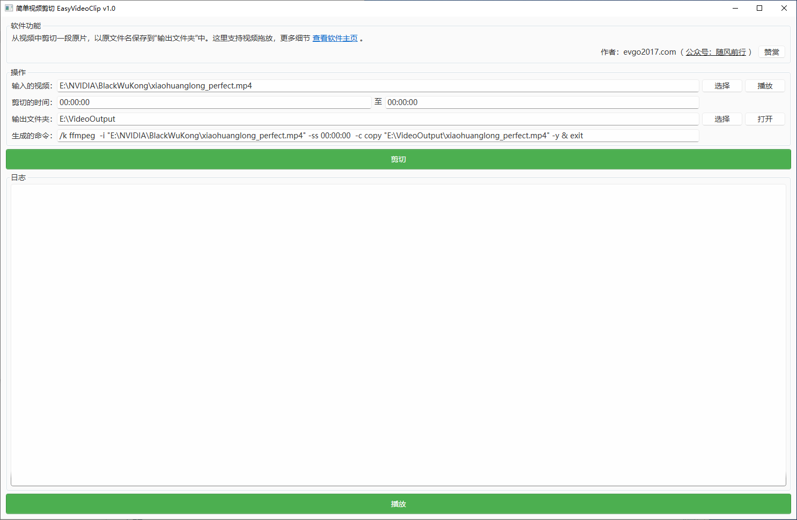

# EasyVideoClip 简单视频剪切
从视频文件中提取一段原片，简单视频剪切。



其它更新、更多信息在[软件主页](https://evgo2017.com/blog/office2pdf)查看。

## 一、下载使用

下载地址 1：[网盘](http://evgo2017.ysepan.com/)（项目密码: evgo2017）（两小时内有下载量的限制，故设置密码）

下载地址 2：[Github Release]([Releases · evgo2017/EasyVideoClip](https://github.com/evgo2017/EasyVideoClip/releases))

## 二、使用方式

① 电脑安装 [.net 9 运行时](https://aka.ms/dotnet-core-applaunch?missing_runtime=true&arch=x64&rid=win-x64&os=win10&apphost_version=9.0.2&gui=true)（点击此链接，会自动打开微软官网下载，安装即可）。

② 运行 `EasyVideoClip.exe` 即可使用。

## 三、详细说明

选择要剪切的视频文件之后，就可以一站式操作了。各个按钮的排列，就是操作逻辑。

### 使用演示

[使用演示在B站](https://www.bilibili.com/video/BV1Jyd6YhEUe/)

<iframe src="//player.bilibili.com/player.html?bvid=BV1Jyd6YhEUe&page=1" scrolling="no" border="0" frameborder="no" framespacing="0" allowfullscreen="true"> </iframe>

> 注：视频音色为工具生成。

### 注意事项

1 `播放` 按钮会使用你本地默认的视频播放器来播放视频，不改变个人使用习惯。

> 我习惯并推荐使用 `Potplayer`，效果好、速度快、功能多。

2 时间格式为 `00:00:00`（时分秒）。

> 结束的时间可以填 `00:00:00`，就会从开始时间直接剪切到视频末尾了。

3 `剪切` 按钮会把视频保存到 `输出文件夹`，若存在同名文件，则直接覆盖。

> 这个逻辑是我多次使用后确定的，有时候频繁微调剪切时间，直接覆盖是最简单高效的。

4 执行的命令以 `生成的命令` 为准，日常使用不需要关注此内容。

> 默认生成的命令适用大多视频，但总会有例外。当遇到某些视频剪切不完美时，查看下方的常见问题。

### 常见问题

某些视频剪切不完美，调整 `生成的命令` 的参数，基本就解决了。

1 视频画面卡住一秒才流畅。

此时将 `-i` 参数放在`-to` 之后即可。演示视频内有讲到这一点。

```shell
/k ffmpeg -i "输入的视频地址" -ss 00:00:00 -to 00:01:00 -c copy "输出的视频地址" -y & exit

改为：

/k ffmpeg -ss 00:00:00 -to 00:01:00 -i "输入的视频地址" -c copy "输出的视频地址" -y & exit
```

2 更多问题

目前暂未发现，遇到问题时，建议搜索 `ffmpeg <你的问题描述>` 调整即可。

## 四、版本更新记录

| 时间       | 内容     | 相关文章                                                     |
| ---------- | -------- | ------------------------------------------------------------ |
| 2025.05.29 | v1，开源 | [开源地址](https://github.com/evgo2017/EasyVideoClip)        |
| 2025.04.13 | v1，发布 | [简单视频剪切（EasyVideoClip v1.0）](https://mp.weixin.qq.com/s/7NMBwEK21mtvgQVxIbDTWw) |
